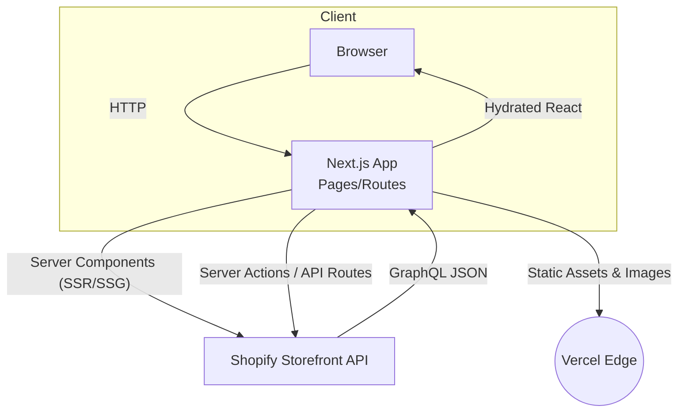
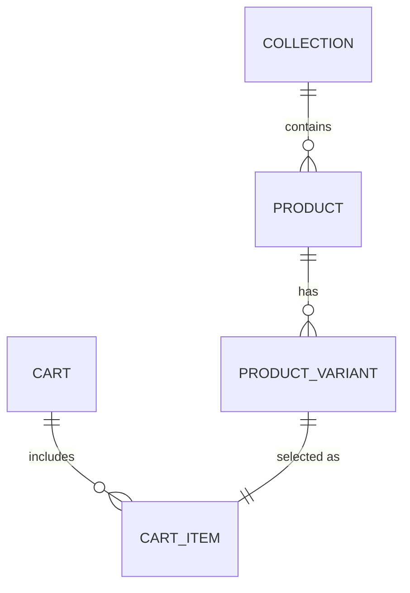
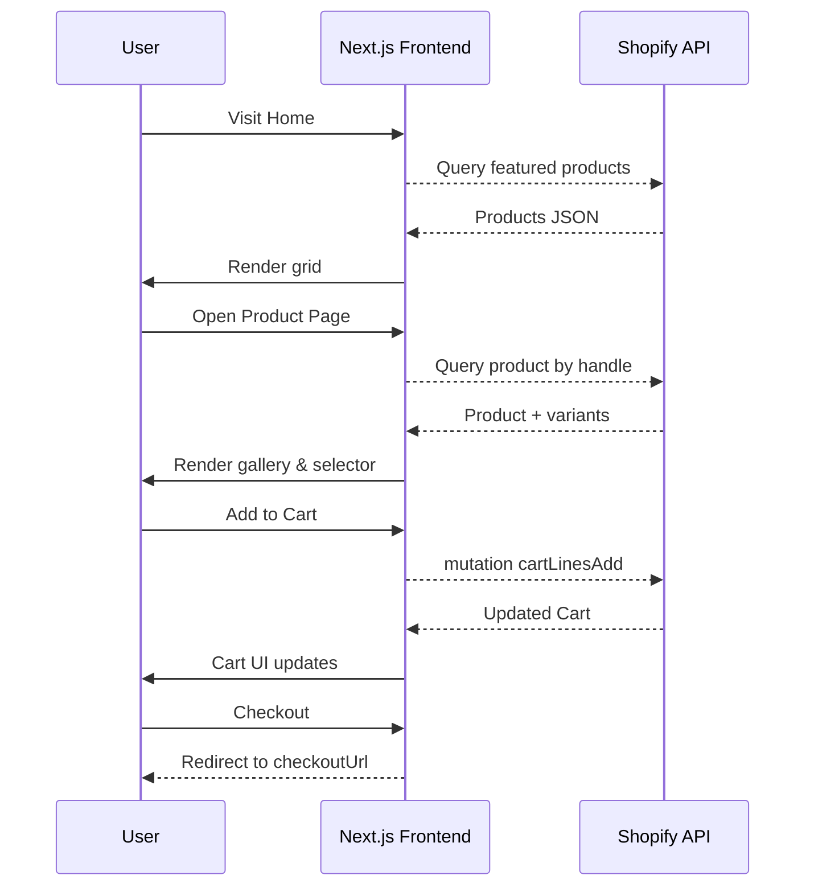

# Commerce Codebase – System Analysis

## 1. Introduction
The `commerce` repository is a modern e-commerce storefront built with **Next.js 15** and integrates with **Shopify Storefront GraphQL API** for back-end commerce operations.  
It provides the presentation layer, client-side interactions, and server actions necessary to browse products, manage a cart, and redirect users to checkout on Shopify.

---

## 2. System Architecture

### 2.1 Overall Architecture
The application follows a **server-first React architecture**:

1. **Next.js App Router** – server components fetch data from Shopify at build/run-time, leveraging built-in caching and ISR.
2. **Client Components** – handle interactive UI (cart updates, variant selection) with optimistic UI via `useOptimistic`.
3. **Server Actions & API Routes** – mutate cart data (add / update / remove) through Shopify GraphQL mutations.
4. **Shopify Storefront API** – single source of truth for products, collections, cart, and checkout.
5. **Edge Runtime / Vercel** – deployment target offering edge caching & image optimization.

### 2.2 Key Components & Relationships
| Layer | Component | Responsibility |
|-------|-----------|----------------|
| Presentation | `app/` pages & layouts | Routing, SSR/SSG, SEO metadata |
| UI | `components/` | Reusable UI (Grid, Gallery, Navbar, Cart UI) |
| State | `components/cart/cart-context.tsx` | Local cart state + optimistic updates |
| Data Access | `lib/shopify/` | GraphQL queries/mutations, data reshaping |
| Utility | `lib/utils.ts`, `lib/constants.ts` | Helpers, config constants |
| Infra | `next.config.ts`, Tailwind, Sonner | Runtime & styling |

### 2.3 Technology Stack
- **Next.js 15 (React 19)** – server & client components, server actions  
- **TypeScript** – static typing across codebase  
- **Tailwind CSS 4** – utility-first styling  
- **Shopify Storefront API (GraphQL 2023-01)** – commerce backend  
- **Vercel Edge / Node 18+** – hosting environment  
- **Redis (optional)** – runtime cache (via `next/cache`)  
- **PostCSS / Prettier** – build & formatting tools  

### 2.4 Architecture Diagram

---

## 3. Data Models

### 3.1 Main Entities
| Entity | Core Fields (simplified) |
|--------|--------------------------|
| **Product** | id, handle, title, description, images[], priceRange, variants[] |
| **ProductVariant** | id, title, selectedOptions[], price |
| **Collection** | handle, title, description, products[] |
| **Cart** | id, lines[], totalQuantity, cost, checkoutUrl |
| **CartItem** | id, quantity, merchandise(Variant), cost |
| **Menu** | title, path |

### 3.2 Entity Relationships
- A **Collection** _has many_ **Products**  
- A **Product** _has many_ **ProductVariants**  
- A **Cart** _has many_ **CartItems**  
- A **CartItem** _references one_ **ProductVariant** and thereby its **Product**

### 3.3 ERD Diagram

---

## 4. Key Functionality

### 4.1 Main Features
1. **Product Discovery**
   - Home page grid & carousel
   - Search with sorting (relevance, price, newest, trending)
2. **Product Detail**
   - Responsive gallery, variant selector, price, rich description
3. **Shopping Cart**
   - Add, update, remove items with optimistic UI
   - Persisted server-side via Shopify cart ID cookie
4. **Secure Checkout**
   - Redirect to Shopify checkout URL
5. **Collections & Filtering**
   - `/search/[collection]` pages list products within a collection
6. **SEO & Performance**
   - Dynamic `metadata` per page, automatic OG images
   - Edge caching with `next/cache` tags & revalidation

### 4.2 Typical User Flows

---

## 5. Integration Points
| External Service | Purpose | Method |
|------------------|---------|--------|
| **Shopify Storefront GraphQL** | Products, collections, cart mutations, checkout URL | HTTPS GraphQL |
| **CDN / Vercel Edge** | Image optimization & static asset delivery | Remote patterns (`cdn.shopify.com`) |
| **Email / SMS (future)** | Notifications after order | Webhooks listener ready |
| **Shopify Webhooks** | Revalidate product/collection cache | `/app/api/revalidate` route |

---

## 6. Conclusion
The `commerce` codebase is a lightweight yet full-featured e-commerce frontend that leverages Next.js server components and Shopify’s Storefront API to deliver high-performance shopping experiences.  
Its modular design, clear separation between UI, state, and data layers, and strong integration with Shopify make it an excellent foundation for scaling or customization.

